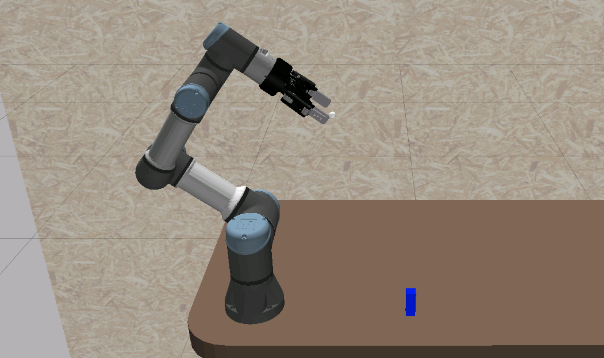
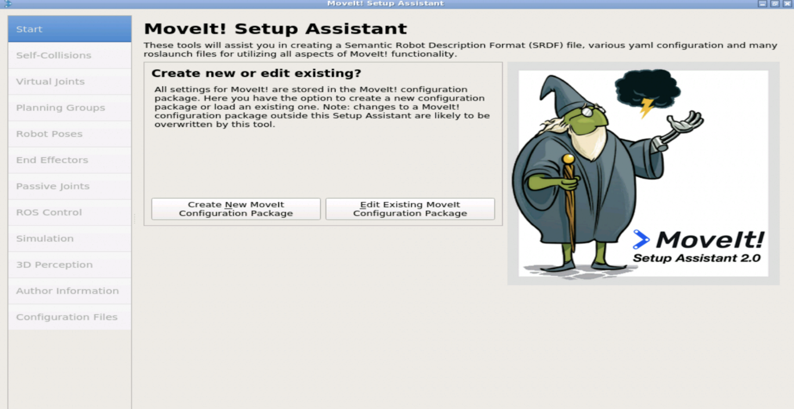

# Manipulation Project

This project focuses on developing a basic Pick & Place task using Moveit2 for the UR3e robotic arm and involves configuring the MoveIt2 package for the UR3e, followed by creating a C++ program that leverages the Move Group Interface API, which will orchestrate a series of precise motions to pick an object from a table and place it at a different location.

  

## Structure

```text
.
├── moveit2_scripts
│   ├── launch
│   │   └── pick_and_place.launch.py
│   ├── src
│   │   ├── pick_and_place_real.cpp
│   │   └── pick_and_place_sim.cpp
│   ├── CMakeLists.txt
│   └── package.xml
├── my_moveit_config
│   ├── config
│   │   ├── name.srdf
│   ├── launch
│   │   ├── move_group.launch.py
│   │   ├── moveit_rviz.launch.py
│   ├── CMakeLists.txt
│   └── package.xml
├── real_moveit_config
│   ├── config
│   │   ├── name.srdf
│   ├── launch
│   │   ├── move_group.launch.py
│   │   ├── moveit_rviz.launch.py
│   ├── CMakeLists.txt
│   └── package.xml
└── README.md
```

## Setup

#### Distribution

Use docker for quick-start (for both ROS1 or ROS2):

```bash
# using docker for ROS1
$ docker run -ti --rm --name local-ros-noetic ros:noetic
# using docker for ROS2
$ docker run -ti --rm --name local-ros-humble ros:humble
```

#### Build (Package)

Now, create a ros2 workspace, clone the package:

```bash
# setup directory
$ mkdir ~/ros2_ws/src/
$ git clone <repo_name> ~/ros2_ws/src/
```

Install the required packages (dependency) mentioned in `package.xml` using `apt`:

```bash
# check if package is available
$ ros2 pkg list
$ ros2 node list
# update path to installed packages
$ source /opt/ros/humble/setup.bash
```

To build locally or inside docker use the following commands:

```bash
# execute build
$ cd ~/ros2_ws && colcon build
$ source ~/ros2_ws/install/setup.bash
```

## Robot

The `UR3e` is a compact collaborative robot (cobot) designed for precise, efficient automation in confined spaces, ideal for industries requiring high flexibility and safety. Its lightweight design and advanced safety features allow it to work alongside humans in various settings, including tabletop operations and integrated workstations.



All the different joints invloved in `UR3e` robot.

```text
- shoulder_pan_joint
- shoulder_lift_joint
- elbow_joint
- wrist_2_joint
- wrist_3_joint
- wrist_1_joint
- robotiq_85_left_knuckle_joint
```

**Note:** Check more details about `UR3e` from [here](https://www.universal-robots.com/products/ur3-robot/).

## Launch

The `move_group.launch.py` launch script used to configure and run the Move Group node in MoveIt2, which handles motion planning, manipulation, and interaction with the robot's kinematic model and `moveit_rviz.launch.py` launch script that sets up and runs an RViz session pre-configured with the MoveIt2 plugin.

```bash
# terminal 1
$ ros2 launch my_moveit_config move_group.launch.py
```

```bash
# terminal 2
$ ros2 launch my_moveit_config moveit_rviz.launch.py
```


The `pick_and_place.launch.xml` launch file contains `pick_and_place.cpp` which uses the `move group interface` to generate a pick & place sequence.

```bash
# terminal 3
$ ros2 launch moveit2_scripts pick_and_place.launch.py
```


**Note :** Above image is for simulation and is using fixed/pre-defined location of the the cube for calculation of inverse kinematics.

## Specifications

#### MoveIt2

MoveIt2 is an advanced robotics middleware for motion planning, built specifically for ROS 2, enhancing the original MoveIt framework's capabilities with improved speed, reliability, and support for new features of ROS 2. It provides an extensive suite of tools for robotic manipulation, enabling efficient planning, collision detection, and kinematic computation.

```bash
# terminal 1
$ ros2 launch moveit_setup_assistant setup_assistant.launch.py
```



**Note :** The `Setup Assistant` helps in the process of configuring a MoveIt2 package for your specific robot.

## Roadmap

- [x] Task 1 : Configure MoveIt2 package.
- [x] Task 2 : Pick & place cube using MoveIt2 C++ API.

See the [open issues](https://github.com/llabhishekll/manipulation_project/issues) for a full list of proposed features (and known issues).

## Tools

System tool/modules used for project development.

- `Applications` : [vs-code](https://code.visualstudio.com/), [ros-extensions](https://marketplace.visualstudio.com/items?itemName=ms-iot.vscode-ros) and [docker-desktop](https://docs.docker.com/get-docker/).
- `ROS` : [ros-docker-images](https://hub.docker.com/_/ros/) (`humble`, `noetic`) or [build-source](https://www.ros.org/blog/getting-started/).

## License

Distributed under the MIT License. See `LICENSE.txt` for more information.
